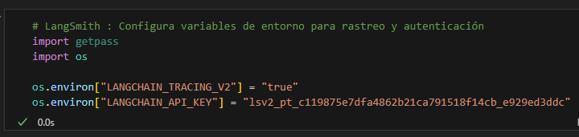
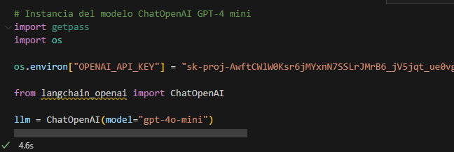
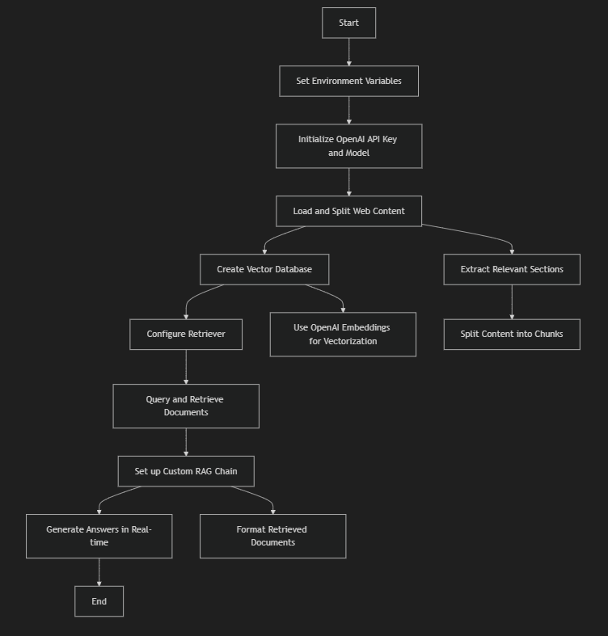

# LangChain RAG Application Project

This project showcases how to use LangChain to build a Retrieval-Augmented Generation (RAG) application. The application combines prompt templates, LLM chains, retrieval systems, and conversational memory to respond to user queries using information sourced from the web.


## Getting Started

These instructions will get you a copy of the project up and running on your local machine for development and testing purposes.

### Prerequisites

You need to install the following tools and configure their dependencies:

1. **Java** (versions 3.12.3)
    ```sh
    python --version
    ```
    Should return something like:
    ```sh
    Python 3.12.3
    ```

2. **Git**
    - Install Git by following the instructions [here](http://git-scm.com/book/en/v2/Getting-Started-Installing-Git)

    Verify the installation:
    ```sh
    git --version
    ```
    Should return something like:
    ```sh
    git version 2.2.1
    ```

3. **Dependencias adicionales, como ipykernel para Jupyter Notebooks.**

### Installing

1. Clone the repository and navigate into the project directory:
    ```sh
    git clone https:https://github.com/Richi025/RAGApp 
    cd RAGApp
    ```

2. ### API Key Configuration

    This project requires API keys to access OpenAI and LangSmith. Follow these steps to obtain them:

    1. **OpenAI API Key**:
    - Go to [https://platform.openai.com/](https://platform.openai.com/) and log in to your account.
    - In the top-right corner, go to your profile and select "View API Keys."
    - Click "Create new secret key" to generate a new key.
    - **Note**: Copy and save the key in a secure location, as you won’t be able to view it again after closing the dialog.

    More information: [Where do I find my OpenAI API Key?](https://help.openai.com/en/articles/4936850-where-do-i-find-my-openai-api-key)

    2. **LangSmith API Key**:
    - Visit [https://smith.langchain.com/setup](https://smith.langchain.com/setup) and log in.
    - Once logged in, go to your account settings and generate a new API key.

    For detailed instructions: [Create an account and API key in LangSmith](https://docs.smith.langchain.com/administration/how_to_guides/organization_management/create_account_api_key)

    In the Jupyter Notebook, configure the API keys by following the instructions in the code to set the environment variables `OPENAI_API_KEY` and `LANGCHAIN_API_KEY`.


### Running the Application


### LangChain Workflow Steps

---

### Step 1: Setting up environment variables for LangSmith
```python
import getpass
import os

os.environ["LANGCHAIN_TRACING_V2"] = "true"
os.environ["LANGCHAIN_API_KEY"] = "your_api_key"
```


In this step, we configure the environment variables needed to enable tracing in LangSmith and authenticate our operations using an API key. This allows us to track and analyze the workflow execution.

---

### Step 2: Setting up the OpenAI API key and initializing the model
```python
import getpass
import os

os.environ["OPENAI_API_KEY"] = "your_openai_key"
from langchain_openai import ChatOpenAI

llm = ChatOpenAI(model="gpt-4o-mini")
```


Here, we configure the OpenAI API key as an environment variable to enable access to its models. Then, we initialize the `GPT-4 Mini` model, which will be used later to generate text or answer questions.

---

### Step 3: Loading and splitting web content
```python
import bs4
from langchain_community.document_loaders import WebBaseLoader
from langchain_text_splitters import RecursiveCharacterTextSplitter

loader = WebBaseLoader(
    web_paths=("https://lilianweng.github.io/posts/2023-06-23-agent/",),
    bs_kwargs=dict(
        parse_only=bs4.SoupStrainer(class_=("post-content", "post-title", "post-header"))
    ),
)
docs = loader.load()

text_splitter = RecursiveCharacterTextSplitter(chunk_size=1000, chunk_overlap=200)
splits = text_splitter.split_documents(docs)
```
At this stage, we fetch content from a specific URL, extracting only the relevant sections such as titles, headers, and the main content. The content is then divided into chunks of a fixed size to facilitate indexing and retrieval later.

---

### Step 4: Creating the vector database
```python
from langchain_chroma import Chroma
from langchain_openai import OpenAIEmbeddings

vectorstore = Chroma.from_documents(documents=splits, embedding=OpenAIEmbeddings())
```
In this step, we create a vector database using the previously generated text chunks. These vectors are generated using OpenAI embeddings, enabling efficient similarity-based search.

---

### Step 5: Configuring the retriever and generating responses
```python
retriever = vectorstore.as_retriever(search_type="similarity", search_kwargs={"k": 6})

retrieved_docs = retriever.invoke("What are the approaches to Task Decomposition?")
```
Now, we configure a retriever that searches for relevant documents in the vector database. Then, we query the retriever to get information about "Task Decomposition" and retrieve the most relevant chunks.

---

## Step 6: Cleaning up the vector database
```python
vectorstore.delete_collection()
```
Here, we clean up the vector database by deleting all stored collections. This is useful to free up space and ensure no residual information from previous sessions remains.

---

### Step 7: Extracting specific data
```python
bs4_strainer = bs4.SoupStrainer(class_=("post-title", "post-header", "post-content"))
loader = WebBaseLoader(
    web_paths=("https://lilianweng.github.io/posts/2023-06-23-agent/",),
    bs_kwargs={"parse_only": bs4_strainer},
)
docs = loader.load()

len(docs[0].page_content)
```
Here, we filter the web content to keep only the important parts, such as titles and headers. We then validate the extraction by checking the length of the content.

---

### Step 8: Printing the loaded content
```python
print(docs[0].page_content[:500])
```
At this step, we print the first 500 characters of the extracted content to visually inspect that the retrieved data is correct and formatted as expected.

---

### Step 9: Splitting text with start indexes
```python
text_splitter = RecursiveCharacterTextSplitter(
    chunk_size=1000, chunk_overlap=200, add_start_index=True
)
all_splits = text_splitter.split_documents(docs)

len(all_splits)
```
Now, we split the content again, but this time we add start indexes for each chunk. This allows us to trace back the exact source of each segment in the original text.

---

### Step 10: Querying retrieved documents
```python
retriever = vectorstore.as_retriever(search_type="similarity", search_kwargs={"k": 6})

retrieved_docs = retriever.invoke("What are the approaches to Task Decomposition?")
print(retrieved_docs[0].page_content)
```
Here, we query the retriever again to fetch relevant documents. Finally, we display the content of the first retrieved document to verify the results.

---

### Step 11: Setting up a custom RAG chain
```python
from langchain_core.output_parsers import StrOutputParser
from langchain_core.runnables import RunnablePassthrough

def format_docs(docs):
    return "\n\n".join(doc.page_content for doc in docs)

rag_chain = (
    {"context": retriever | format_docs, "question": RunnablePassthrough()}
    | llm
    | StrOutputParser()
)

for chunk in rag_chain.stream("What is Task Decomposition?"):
    print(chunk, end="", flush=True)
```
Finally, we set up a custom RAG chain that combines retrieved documents, formats them as context, and generates a response to the posed question in real-time using the GPT-4 Mini model.

---


## Architectural Design




## Explanation of the Flow

1. **Set Environment Variables**: Configures the environment for authentication and API keys.
2. **Initialize OpenAI API Key and Model**: Sets up the OpenAI API and initializes the model to be used.
3. **Load and Split Web Content**: Downloads the web content and splits it into manageable chunks.
4. **Extract Relevant Sections**: Filters out irrelevant parts.
5. **Split Content into Chunks**: Divides text into fixed-size fragments.
6. **Create Vector Database**: Stores the processed chunks as vectors for efficient searching.
7. **Use OpenAI Embeddings for Vectorization**: Converts text into vector embeddings.
8. **Configure Retriever**: Sets up a retriever to find similar content based on queries.
9. **Query and Retrieve Documents**: Performs similarity-based retrieval to find the most relevant content.
10. **Set up Custom RAG Chain**: Combines the retriever and model for context-based answering.
11. **Format Retrieved Documents**: Prepares documents to serve as input for the model.
12. **Generate Answers in Real-time**: Uses the custom chain to answer questions dynamically.


## Built With

* [Git](http://git-scm.com/) - Version Control System
* [LangChain](https://www.langchain.com/) - Framework for creating applications with large language models
- [Jupyter Notebook](https://jupyter.org/) - Interactive development environment.
* [OpenAI API](https://openai.com/api/) - API for accessing OpenAI's language models


## Versioning

I use [GitHub](https://github.com/) for versioning. For the versions available, see the [tags on this repository](https://github.com/Sebasvasquezz/Mini-Twitter-MicroServices.git).

## Authors

* **Jose Ricardo Vasquez Vega** - [Richi025](https://github.com/Richi025)


## License

This project is licensed under the MIT License - see the [LICENSE.md](LICENSE.md) file for details.

## Date 

**13/11/2024**